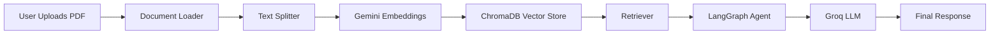
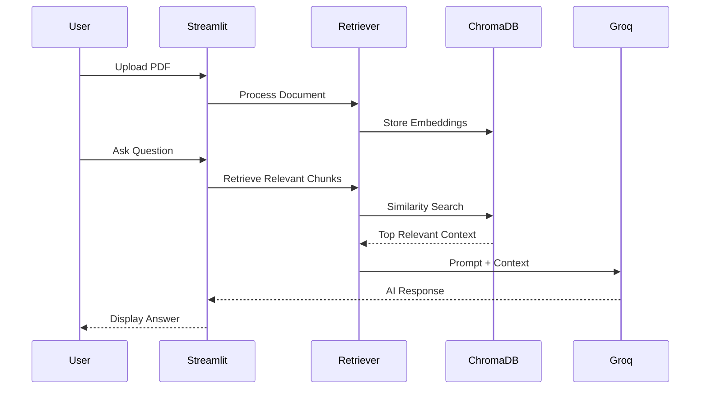

# 📚 Agentic RAG Chatbot

<p align="center">


</p>

---

# 📖 Overview

Agentic RAG Chatbot is an intelligent document question-answering system that enables users to upload PDF documents and interact with them using natural language.

Unlike traditional chatbots, this application uses **Retrieval-Augmented Generation (RAG)** along with an **Agentic workflow powered by LangGraph** to retrieve only the most relevant document chunks before generating responses. This significantly reduces unnecessary context passed to the LLM, resulting in faster, more accurate, and cost-efficient answers.

The project integrates **Google Gemini Embeddings**, **ChromaDB**, **Groq LLMs**, **LangChain**, and **Streamlit** to provide a conversational experience with persistent memory.

---

# ✨ Features

- 📄 Upload one or multiple PDF documents
- 🔍 Semantic document retrieval using vector embeddings
- 🧠 Conversational memory for follow-up questions
- ⚡ High-speed inference using Groq LLM
- 📚 ChromaDB vector storage
- 🤖 LangGraph-powered agent workflow
- 🎯 Context-aware responses
- 💬 Natural language question answering
- 🖥️ Interactive Streamlit interface

---

# 🏗️ System Architecture



---

# 🔄 Workflow



---

# 🛠 Tech Stack

| Category | Technologies |
|----------|--------------|
| Language | Python |
| Framework | LangChain |
| Agent Framework | LangGraph |
| LLM | Groq |
| Embeddings | Google Gemini Embeddings |
| Vector Database | ChromaDB |
| UI | Streamlit |
| Environment | Python Virtual Environment |

---


# ⚙️ Installation

Clone the repository

```bash
git clone https://github.com/yourusername/agentic-rag-chatbot.git

cd agentic-rag-chatbot
```

Create virtual environment

```bash
python -m venv venv
```

Activate

Windows

```bash
venv\Scripts\activate
```

Linux / Mac

```bash
source venv/bin/activate
```

Install dependencies

```bash
pip install -r requirements.txt
```

---

# 🔑 Environment Variables

Create a `.env`

```text
GOOGLE_API_KEY=

GROQ_API_KEY=
```

---

# ▶️ Run Application

```bash
streamlit run app.py
```

---

# 💡 How It Works

### Step 1

Upload one or multiple PDF documents.

↓

### Step 2

Documents are split into smaller semantic chunks.

↓

### Step 3

Each chunk is converted into embeddings using Google Gemini Embeddings.

↓

### Step 4

Embeddings are stored inside ChromaDB.

↓

### Step 5

When a user asks a question, similarity search retrieves the most relevant chunks.

↓

### Step 6

The retrieved context is passed to the Groq LLM.

↓

### Step 7

The chatbot generates an accurate response grounded in the uploaded documents.

---


## Upload PDF


---

## Chat Interface


---

# 🚀 Future Improvements

- Multi-document collections
- Hybrid Search (BM25 + Vector Search)
- Document summarization
- Citation-aware responses
- Authentication
- Docker support
- Cloud deployment
- Streaming responses
- Multi-user conversations

---

# 📈 Learning Outcomes

This project strengthened my understanding of:

- Retrieval-Augmented Generation (RAG)
- LangChain pipelines
- LangGraph stateful workflows
- Vector databases
- Embedding models
- Prompt engineering
- Conversational memory
- LLM orchestration
- Semantic search

---

# 🤝 Contributing

Contributions are welcome.

If you would like to improve the project:

1. Fork the repository

2. Create a feature branch

3. Commit your changes

4. Open a Pull Request

---

# 📄 License

This project is licensed under the MIT License.

---

# 👨‍💻 Author

**Uttam N**

Final Year Computer Science (Cyber Security)

Passionate about

- Software Engineering
- Artificial Intelligence
- Generative AI
- Agentic AI Systems
- Large Language Models

LinkedIn: *Add Your Profile*

GitHub: *Add Your Profile*

---

## ⭐ If you found this project useful, consider giving it a star!
